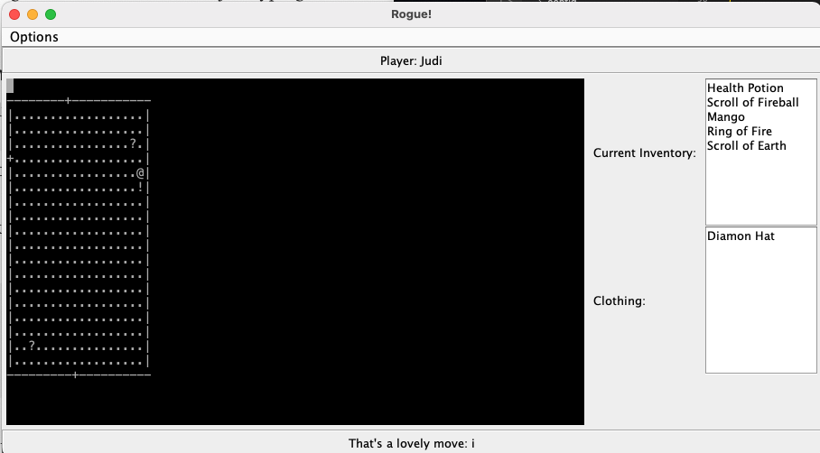

#   Rogue

Rogue is a dungeon crawling game in which the player explores rooms, loots different items, and fends off monsters.

##  Compilation

Use gradle to compile Rogue.

```bash
gradle build
```

##  Run

```bash
java -jar build/libs/A3.jar
```

##  Version 3

Displays the rooms on the terminal. The player can move using "i, k, j, l".
Some additional feature have been added. you can now eat, toss, and wear items using
the following commands "e, t, w". There is an inventory which tells you what you currently 
have and what you are wearing. You can also save the game and load it later on.
Explore the dungeon and pick up items!


Example of json:
```json
{
    "room": [{
            "id": 1,
            "start": true,
            "height": 10,
            "width": 20,
            "doors": [{
                "dir": "W",
                "con_room": 2,
                "wall_pos": 3
            },
            {
                "dir": "E",
                "con_room": 2,
                "wall_pos": 5
            }],
            "loot": [{
                    "id": 1,
                    "x": 3,
                    "y": 3
                },
                {
                    "id": 2,
                    "x": 8,
                    "y": 8
                }
            ]
        }
    ],
    "items": [{
			"id": 1,
			"name": "Health Potion",
			"type": "Potion",
			"description": "you feel better: You toss the Health Potion"
		},
		{
			"id": 2,
			"name": "Scroll of Fireball",
			"type": "Scroll",
			"description": "A 20 foot ball of flame hurtles away from you"
		},
		{
			"id": 3,
			"name": "Mango",
			"type": "Food",
			"description": "my that was a yummy mango!"
		}
    ]
}
```

Here is a screenshot of what to expect:



Have fun!
